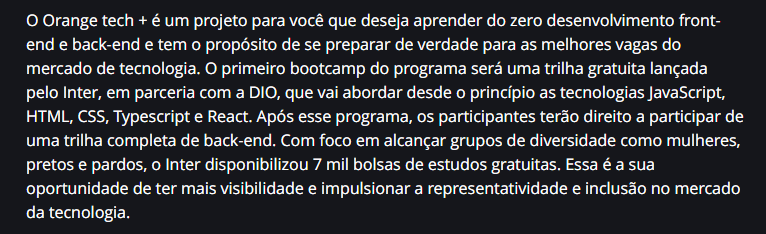
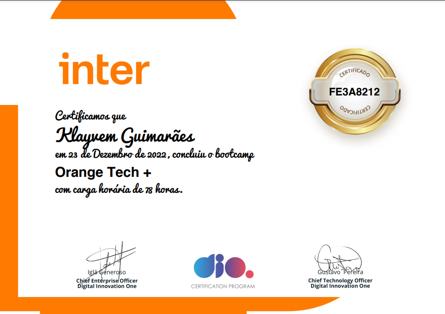

## Bootcamp Orange Tech + | Banco Inter e Dio.

    > Carga horária de 78 horas | Front-End 🧑🏻‍💻

    > Certificado de conclusão 🎉

## Tudo que foi abordado & Tecnologias

      > Pensamento computacional
        Decomposição, Padrôes, Abstração, Algoritmos e Lógica de programação.

      > Fundamentos de Algoritmos.
        Tipologia e Variáveis, Instruções Primitivas, Estruturas Condicionais e Operadores, 
        Estruturas de Repetição, Vetores, Matrizes e Funções. 

      > GIT
        Como versionar e subir um projeto para o repositório Github.
        Comandos base.
        Mexendo no terminal.
        Como navegar entre pastas.
        Commit, deploy, push, clonar etc.

      > GITHUB
        Como fazer uma chave privada e pública (ssh-key).

      > HTML
        Estrutura Base.

      > CSS
        Propriedades, Estilizações, ID`s etc.  

      > JAVASCRIPT
        Funções, Arrays e Estruturas de Repetição, Importtação e Exportação, Desenvolvimento WEB,
        Protocolo HTTP.
        Manipulação HTML.
        Projetos.

      > REACT-JS
        Styled-Components.
        Hook-forms.
        React-Router-Dom.
        React-icons.
        React Hooks.
        React Hooks-forms.
        Inicialização na WEB.
        Conectar com APi.
        Projetos.

      > TYPESCRIPT-JS
        Tipagem e conceitos.
        Projeto.

      > API AXIOS
        Uma biblioteca que permite a integração do projeto React com qualquer API.
      
      > FIGMA
        Design.  
        Auxilio para desafios.